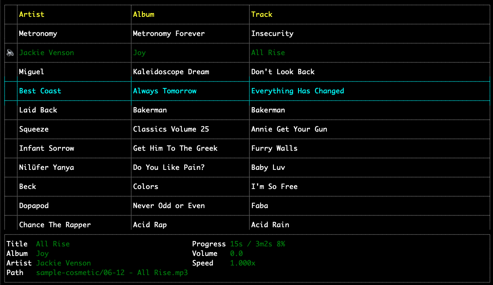

# grump



```
Great but
Really
Ugly
Media
Player
```

A very minimal CLI audio player.

## Features

* cross-platform
* ID3 tag scanning
* Supports
	* FLAC
	* MP3
	* OGG/Vorbis
	* WAV

## Install

### Linux

```sh
apt install libasound2-dev build-essential
go get github.com/dhulihan/grump
```

### Mac OSX

```sh
brew install dhulihan/grump
```

Alternatively, you can install the latest (possibly unreleased) version:

```sh
go get github.com/dhulihan/grump
```

* You can also download pre-build binaries on the [releases](https://github.com/dhulihan/grump/releases) page.

## Usage

```
grump path/to/some/audio/files
```

## Development

### Building

```sh
# build for linux (linux host)
./scripts/build-linux.sh

# build for linux (non-linux host)
docker-compose run build

# build for darwin (darwin host)
./scripts/build-darwin.sh
```

### Releasing

```sh
VERSION=0.0.0
git tag $VERSION
git push origin $VERSION
goreleaser release --rm-dist
```
